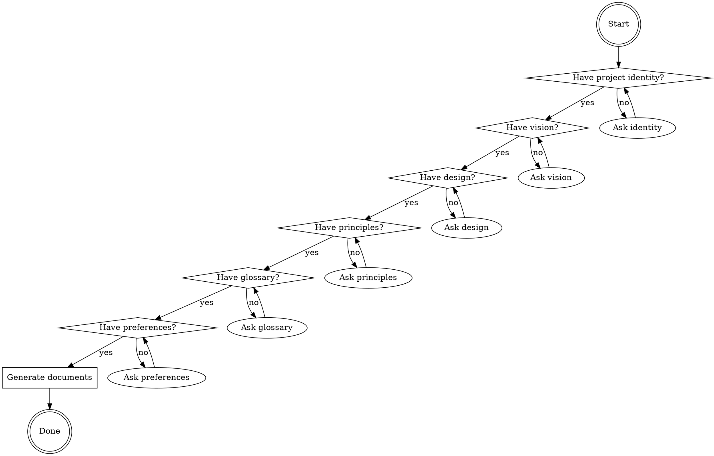

# ELP Phase 1: Project Setup

## Overview
Set up a new project for Empirical Lane Parallelism (ELP). This skill guides the human through creating the mandatory initial documentation and configuration that all subsequent lanes depend on.

**Goal:** Produce a complete `docs/` directory with vision, design, principles, glossary, and `elp-config.json`.

## When to Use
- Starting a greenfield project with ELP
- Onboarding a new project to the ELP method
- Missing prerequisites (vision, design, principles, glossary)

## When NOT to Use
- Project already has ELP documentation in place
- Just launching a new lane (use elp-phase2-brief instead)

## Interview Process

The human is the architect. You must interview them until you have enough information to generate the initial documents. Ask one question at a time and wait for answers.

### Required Information

1. **Project identity**
   - Project name
   - One-line description
   - Git repository URL
   - GitHub owner and repo name

2. **Product Vision** (`docs/vision.md`)
   - What problem does this solve?
   - Who are the target users?
   - What is the solution in 2-3 sentences?
   - What is explicitly out of scope?

3. **General Design** (`docs/design.md`)
   - Technology stack (language, runtime, framework, database)
   - High-level architecture (monolith, microservices, serverless, etc.)
   - Key components and their responsibilities
   - Data model overview
   - API style (REST, GraphQL, RPC, etc.)

4. **Architectural Principles** (`docs/principles.md`)
   - What invariants must no lane break?
   - Performance priorities (latency vs throughput)
   - Compatibility constraints
   - Quality gates (tests, linting, byte-identical builds, etc.)

5. **Domain Model** (`docs/glossary.md`)
   - Key domain terms and definitions
   - Relationships between entities
   - Ubiquitous language for the codebase

6. **ELP Preferences**
   - Where to create git worktrees (default: `~/work`)
   - GitHub labels for lanes, audits, retros
   - Subagent model preference (default: haiku)
   - tmux session prefix (default: `elp`)

### Interview Flow

## Document Generation

After collecting all information, generate these files in the project root:

- `docs/elp-config.json` — merged with defaults
- `docs/vision.md` — from interview
- `docs/design.md` — from interview
- `docs/principles.md` — from interview
- `docs/glossary.md` — from interview

Use the templates in `${CLAUDE_SKILL_DIR}/templates/` as starting points.

## Post-Setup Checklist

After generating documents:
- [ ] `docs/vision.md` has problem, users, solution, and non-goals
- [ ] `docs/design.md` has stack, architecture, and data model
- [ ] `docs/principles.md` has invariants no lane can break
- [ ] `docs/glossary.md` has domain terms and relationships
- [ ] `docs/elp-config.json` has valid JSON with project, git, github, agent, and elp sections
- [ ] Human has reviewed and approved all documents
- [ ] Human understands these are living documents that can evolve

## Supporting Files

Bundled templates at `${CLAUDE_SKILL_DIR}/templates/`:
- `vision.md` — product vision template
- `design.md` — general design / architecture template
- `principles.md` — architectural principles template
- `glossary.md` — domain model / glossary template
- `elp-config.json` — project configuration template

## Common Mistakes
- **Accepting vague answers:** If the human says "we'll figure it out later," push back. ELP requires pinned decisions before the first lane.
- **Skipping principles:** Principles are the guardrails. Without them, lanes drift.
- **Generating without review:** Always show the human the generated documents and incorporate feedback before marking done.
- **Forgetting config:** `elp-config.json` is read by scripts. It must be valid JSON.
