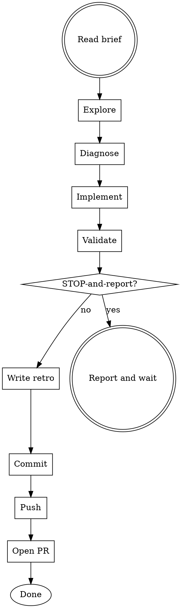

# ELP Phase 3: Lane Execution

## Overview
Execute an approved ELP lane in an isolated git worktree with a dedicated tmux session. The lane agent runs autonomously from start to finish, executing explore-diagnose-implement-validate-retro-commit-push-PR without pausing for confirmation, stopping only at explicit STOP-and-report points.

**Goal:** Produce a review-ready PR with a mandatory retro and build TSV.

## When to Use
- A brief has been generated and approved (elp-phase2-brief)
- The `elp-launch.sh` script has created the worktree and tmux session
- The lane agent is starting execution in autonomous mode

## When NOT to Use
- No approved brief exists (go back to elp-phase2-brief)
- The architect has not authorized this lane
- Prerequisites (vision, design, principles) are missing (use elp-phase1-setup)

## Prerequisites
- [ ] Brief exists at `/tmp/wt-claude-prompt-<issue>-<descr>.txt`
- [ ] Worktree created: `~/work/<project>.issue-<issue>-<descr>/`
- [ ] Branch created: `issue-<issue>-<descr>`
- [ ] tmux session running: `issue-<issue>-<descr>`
- [ ] Architect has approved the brief

## Lane Execution Flow

The lane agent follows this exact sequence:



### Step 1: Read Brief
Read the brief in FULL before acting. The brief is the contract. Every section matters.

### Step 2: Explore
- Read all files listed in "Read First"
- Understand the current state of the codebase
- Map out the minimal set of changes needed

### Step 3: Diagnose
- If fixing a bug: reproduce it first, understand root cause
- If implementing a feature: understand the integration points
- Document findings in the retro (later)

### Step 4: Implement
- Make the smallest delta that satisfies the brief
- Respect all "DO NOT" constraints
- Respect all "Pinned Decisions"
- Do not touch files outside scope

### Step 5: Validate
- Run all required test tiers locally BEFORE push
- Log every build/test invocation to the TSV
- Ensure clean working tree
- Verify no unintended files were modified

**Build TSV Format:**
```bash
export LANE="issue-NNN-descr"
echo -e "timestamp\tcmd\toutcome\telapsed_s" > /tmp/lane-${LANE}-builds.tsv

# Log each invocation:
# echo -e "$(date -Iseconds)\tmake test\tPASS\t45.2" >> /tmp/lane-${LANE}-builds.tsv
```

### Step 6: Write Retro
Write `docs/lane-experiences/lane-experience-issue-NNN-descr.md` BEFORE opening the PR.

**No retro, no PR.** This is mandatory.

Use `${CLAUDE_SKILL_DIR}/templates/retro-template.md`. Fill in ALL sections:
- Objective metrics (start/end timestamps, build counts)
- Change inventory (files, lines, sites)
- Errors encountered (class, location, fix, attempts)
- Friction points
- Ambiguities or interpretive choices
- Subjective summary (confidence, hardest/easiest, tooling)
- Limitations of the report

### Step 7: Commit
- Clean working tree
- Commit message in Conventional Commits format: `<type>(<scope>): <subject>`
- Example: `feat(auth): add JWT middleware`

### Step 8: Push
```bash
git push -u origin issue-NNN-descr
```

### Step 9: Open PR
```bash
gh pr create --title "feat(scope): subject" --body "[include retro summary and link to issue]"
gh pr merge --auto  # if CI green and auto-merge enabled
```

## STOP-and-Report Behavior

When encountering conditions specified in the brief (or any design ambiguity not covered):

1. **STOP** immediately. Do not continue improvising.
2. **Document** the finding in the retro's "Ambiguities" section.
3. **Report** the situation with:
   - What you found
   - Why it's outside scope
   - What you recommend
   - Options with tradeoffs
4. **Wait** for architect/integrator response.

**Do NOT:**
- Make scope decisions yourself
- "Just fix it while I'm here"
- Assume the architect would want X

## Using Subagents

For complex lanes, dispatch subagents for parallelizable sub-tasks:

```
# Example: lane needs to implement 3 independent handlers
# Dispatch subagents for each handler while coordinating in the main lane
```

Rules for subagent usage:
- Main lane agent retains overall coordination
- Each subagent gets a subset of the brief context
- Subagents write to the same worktree (coordinated)
- Main lane integrates subagent outputs
- All outputs still go through the main lane's retro and PR

## Monitoring and Intervention

The integrator (or human) can monitor the lane using the bundled scripts:
```bash
bash "${CLAUDE_SKILL_DIR}/scripts/elp-monitor.sh" issue-NNN-descr
```

If correction is needed, use `tmux send-keys` to preserve context:
```bash
tmux send-keys -t issue-NNN-descr 'your guidance here' Enter
```

**Re-briefing from scratch loses accumulated context.** Prefer targeted intervention.

## Absolute Rules for Lane Agents

1. **Do not touch versioning files** (`CHANGELOG`, `VERSION`)
2. **No direct push to `main`** — always PR
3. **Without explicit authorization, no `worktree remove`, no `branch -D`**
4. **Do not compromise the user's work** — investigate before deleting
5. **Mandatory retro** for every lane
6. **Phase 0 audits** for large milestones (handled before this lane)
7. **Honesty over optimism** — report what was measured
8. **Detailed brief** — read it fully before acting
9. **Pinned principles are not re-discussed**

## Supporting Files

Bundled templates at `${CLAUDE_SKILL_DIR}/templates/`:
- `retro-template.md` — mandatory lane retro with all required sections
- `phase0-audit-template.md` — Phase 0 documentary audit template
- `honesty-targets-template.md` — honesty targets per feature

Bundled scripts at `${CLAUDE_SKILL_DIR}/scripts/` (run from project root or set `ELP_PROJECT_DIR`):
- `elp-setup.sh` — initialize a project for ELP
- `elp-launch.sh <issue> <description>` — create worktree, branch, tmux session, and launch the lane agent
- `elp-monitor.sh [session]` — view active lanes and tail their output
- `elp-cleanup.sh <issue> <description>` — destroy lane resources after PR integration

## Common Mistakes
- **Skipping the retro:** "I'll write it later." No. No retro, no PR.
- **Thin build logs:** Every `make` or `npm test` must be logged to TSV.
- **Fixing out-of-scope bugs:** STOP-and-report. Open a new issue.
- **Touching files not in scope:** Respect the brief's file list.
- **Improvising commit messages:** Use Conventional Commits format.
- **Not reading the brief first:** The brief is the contract. Read it fully.

## Post-Lane Checklist

- [ ] All "DO" items completed
- [ ] No "DO NOT" items violated
- [ ] All STOP-and-report conditions handled
- [ ] Build TSV has entries for every build/test invocation
- [ ] Retro written with all mandatory sections
- [ ] Commit message follows Conventional Commits
- [ ] PR opened with link to issue
- [ ] Auto-merge enabled (if applicable)
- [ ] Lane agent reports completion to integrator
